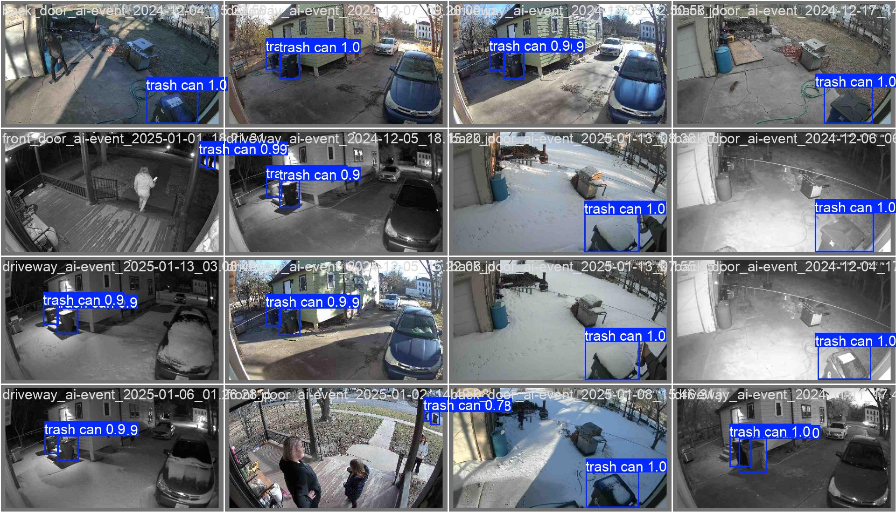

Forgetting to take out the trash can be frustrating, and I do it a lot. To solve this problem, I built a reminder system using Home assistant and Node-RED to alert me on my phone, computers, TV, and smart speakers. This worked great IF I remembered to turn off the "put out trash today" switch...I didn't.

So, I created an locally-hosted AI-powered solution using YOLO object detection, with a model specifically trained to recognize my trash cans. Now, the system automatically stops the reminders once I’ve put the trash out!

## Machine Learning Approach

I leveraged YOLO, a real-time object detection algorithm, to train a model specifically designed to detect my trash cans. The process involved:

- **Dataset Collection:** Gathering and labeling images of trash cans from various angles, lighting conditions, and weather scenarios to ensure accurate detection.
- **Model Training:** Using YOLO to train a custom model, fine-tuning hyperparameters for accuracy.
- **Testing and Optimization:** Conducting multiple tests to minimize false positives and enhance detection reliability in all conditions.
- **Retraining and Fine-tuning:** Analyzing misdetections, labeling them correctly, and retraining the model to improve accuracy.
- **API setup:** Configuring an API Docker container to serve as the interface between the YOLO model and my home automation system.

## Integration with Home Automation

After training the model and ensuring its accuracy, I integrated it into my home automation setup using Node-RED:

- **Camera Integration:** Security cameras capture images when motion is detected.
- **Image Processing:** Node-RED sends API request with image to YOLO Docker container, where it is analyzed to detect the presence of a trash can and returns the results.
- **Notification System:** If a trash can is detected by the front cameras, it confirms the trash has been put out and stops the reminders.

## Results and Impact

This system has significantly improved the reliability of my trash reminders and reduced notification fatigue. The project demonstrates a practical application of machine learning and automation to solve everyday challenges efficiently.

## Conclusion

This project showcases how AI and automation can be combined to create smart, practical solutions. By leveraging YOLO’s real-time object detection, I developed a system that reduces forgetfulness and enhances household efficiency. It’s a great example of applying machine learning to everyday life in a meaningful way.
