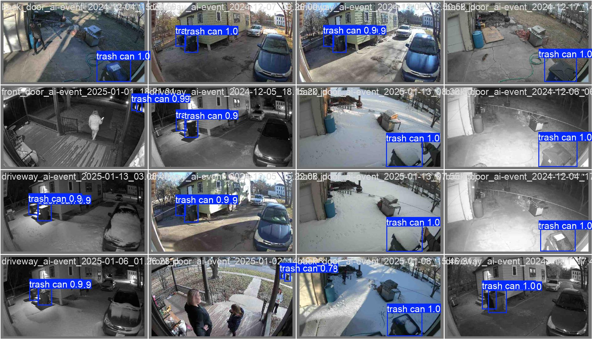
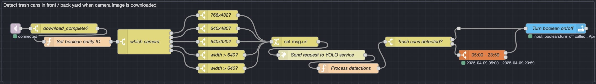
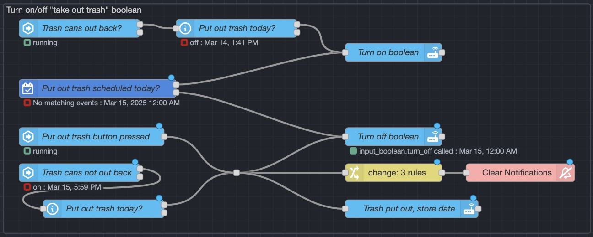
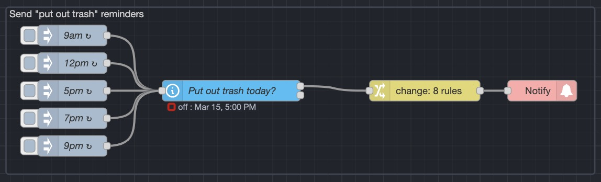

Forgetting to take out the trash can be frustrating, and I do it a lot. To solve this problem, I built a reminder system using Home assistant and Node-RED to alert me on my phone, computers, TV, and smart speakers. This worked great IF I remembered to turn off the "put out trash today" switch...I didn't.



So, I created an locally-hosted AI-powered solution using YOLO object detection, with a model specifically trained to recognize my trash cans. Now, the system automatically stops the reminders once I’ve put the trash out!



## Tech stack

- [eufy-security-ws](https://github.com/bropat/eufy-security-ws) – integrates Eufy Security cameras into Home Assistant
- [Home Assistant](https://www.home-assistant.io) – provides interface to cameras and motion detections
- [Node-RED](https://www.nodered.org) – handles all logic for automations
- [YOLO](https://www.ultralytics.com/yolo) – provides AI-powered object detection
- [YOLO web service](https://github.com/JavierMtz5/YOLOv8-docker.git) – provides web API interface for YOLO inside Docker container
- [EMQX](https://www.emqx.com) – MQTT broker used for messaging
- [Labelme](https://labelme.io/) –- used for labelling images for iterative learning

## Machine learning approach

I leveraged YOLO—a real-time object detection algorithm—to train a model specifically designed to detect my trash cans. The process involved:

- **Dataset collection** – gathering and labeling images of trash cans from various angles, lighting conditions, and weather scenarios to ensure accurate detection
- **Model training** – using YOLO to train a custom model, fine-tuning hyperparameters for accuracy
- **Testing and optimization** – conducting multiple tests to minimize false positives and enhance detection reliability in all conditions
- **Retraining and fine-tuning** – analyzing mis-detections, labeling them correctly, and retraining the model to improve accuracy
- **API setup** – configuring an [API Docker container](https://github.com/JavierMtz5/YOLOv8-docker) to serve as the interface between the YOLO model and my home automation system

```yaml
# Docker Compose file for YOLO trash can detection API container
services:
  yolo:
    container_name: yolo
    image: glandix/yolo
    build:
      context: yolo-trashcan/build
      dockerfile: Dockerfile
      pull: true
    ports:
      - 9192:8080
    env_file:
      - ../.env
    restart: always
    volumes:
      # Maps custom-trained model to expected location within container
      # (allows reuse of the image with other models)
      - ./yolo-objects/yolo11m.pt:/home/app/yolov8m.pt
      # Maps directory where camera images are located for processing
      - /home/storage/internal/ha_media:/media
    deploy:
      resources:
        limits:
          pids: 600
          cpus: "6"
          memory: 8G
    security_opt:
      - no-new-privileges:true
```

## Integration with Home Automation

After training the model and ensuring its accuracy, I integrated it into my home automation setup using Node-RED:

- **Camera Integration** – security cameras capture images when motion is detected
- **Image Processing** – Node-RED sends API request with image to YOLO Docker container, where it is analyzed to detect the presence of a trash can and returns the results
- **Notification System** – if a trash can is detected by the front cameras, it confirms the trash has been put out and stops the reminders



## Trash can detection logic

**Four cameras in two locations** are checked for trash cans:

- two in front (front door and front yard)
- two in the backyard (driveway and back door)

This lets me know with reasonable certainty **whether the trash cans are in the front or back yard**. The selected cameras also reduce the likelihood of a neighbor's trash cans being detected.



1. Node-RED listens to the MQTT topic `camera/+/event` for an `image_downloaded` event sent by my [camera notifications flow](../event-driven-camera-notifications#2-image-change-monitoring-and-download)
2. The image size (contained in the MQTT payload) is compared to the known size of a full notification image and only proceeds it matches
    - *This prevents cropped images (such as would occur with a person detection event on the camera) from being processed for trash cans, as they often are cropped out*
3. The image is sent to a locally-run YOLO service using a model custom-trained on my particular trash cans
4. The number of trash cans detected is counted and if > 1, the trash cans are assumed to be in the same location as the camera image being processed

    ```js
    //
    // Code for "Process detections" function node
    //

    // Only count detections with a confidence level of 75%+
    let confidence = 0.75

    // If detections were returned, process them
    if (msg.payload.data.inference_results[0].detections.length > 0) {
        const detections = msg.payload.data.inference_results[0].detections

        // Filter array of detections by confidence level
        const trashCans = detections.filter((value) => value.name === "trash can" && value.confidence > confidence)

        // Save trash can count to msg
        msg.numTrashCans = trashCans.length
    }

    // If any trash cans were detected, set state to "on"
    msg.state = msg.numTrashCans > 0 ? "on" : "off"
    return msg;
    ```

5. If the trash cans were NOT detected, only update the trash cans' location between 5AM and 11PM
    - *This prevents false negatives from causing my reminders to prematurely be disabled when a dark camera image causes the system to think the trash cans are no longer out back*

## "Put out trash" reminder logic



1. If a "Put out trash" event is in the "Household Tasks" calendar in Home Assistant, a "Put out trash" input boolean is turned on
2. If trash cans are NOT detected out back and trash is scheduled to be put out today, it's assumed the trash has been put out, so "Put out trash" is turned off
3. If trash cans ARE detected out back and trash is scheduled to be put out today, the "Put out trash" boolean is turned on
    - *This is a fail-safe in the off-chance that a false negative causes the system to think trash had been put out prematurely*
4. At 9am, 12pm, 5pm, and 7pm if "Put out trash" boolean is on, reminders are sent in the form of notifications and spoken announcements on smart speakers in occupied rooms. If "Put out trash" is off, the reminders are skipped



## **Future improvements**

- [ ] Streamline YOLO call to reduce duplicated nodes
- [ ] Add support for checking if image is mostly black and discarding any detection results to prevent false negatives
  - Would fix the need for the current time-based condition which isn't ideal
  - Maybe instead use lux measured by back door motion sensor?
- [ ] Support for when one trash can is in front and the other is in back
  - Would require more testing to ensure trash can count is correct in cameras that can see both
  - Some cameras can only see one trash can, so this would need to be addressed
  - Would require additional training to ensure accuracy of count

### Automated image collection

- [ ] Add "Trash has been put out" notification
- [ ] Add "No it wasn't" notification action (appears as button on notification)
  - Send filename of image that caused trash to be marked as "put out" in action data
- [ ] When "No it wasn't" action is triggered, copy the file into the training images directory

### Semi-automated retraining

- [ ] Manually label images in training directory
- [ ] Automatically generate dataset with `labelme2yolo` when new Labelme labels are detected in training directory
- [ ] Automatically run YOLO iterative training process for ~10 epochs when changes are detected to output directory of `labelme2yolo`
- [ ] Copy new model .pt file into place when complete
- [ ] Clear out training directory periodically so the model isn't just memorizing

### Nearly fully-automated retraining

- If trash cans out back is turned off only to be turned back on during the same day, submit the image that caused trash cans to be marked "not out back" for iterative retraining
- Would require storing the filename of the image in a Home Assistant input_text when trash cans not out back is turned off
- Images would still have to be labeled manually or semi-manually

## Conclusion

This project showcases how AI and automation can be combined to create smart, practical solutions. By leveraging YOLO’s real-time object detection, I developed a system that reduces forgetfulness and enhances household efficiency. It’s a great example of applying machine learning to everyday life in a meaningful way.

---

## Change log

- **2025.03.26:**
  - Added automated image collection to future improvements
  - Added semi-automated retraining to future improvements
  - Added fully automated retraining to future improvements
