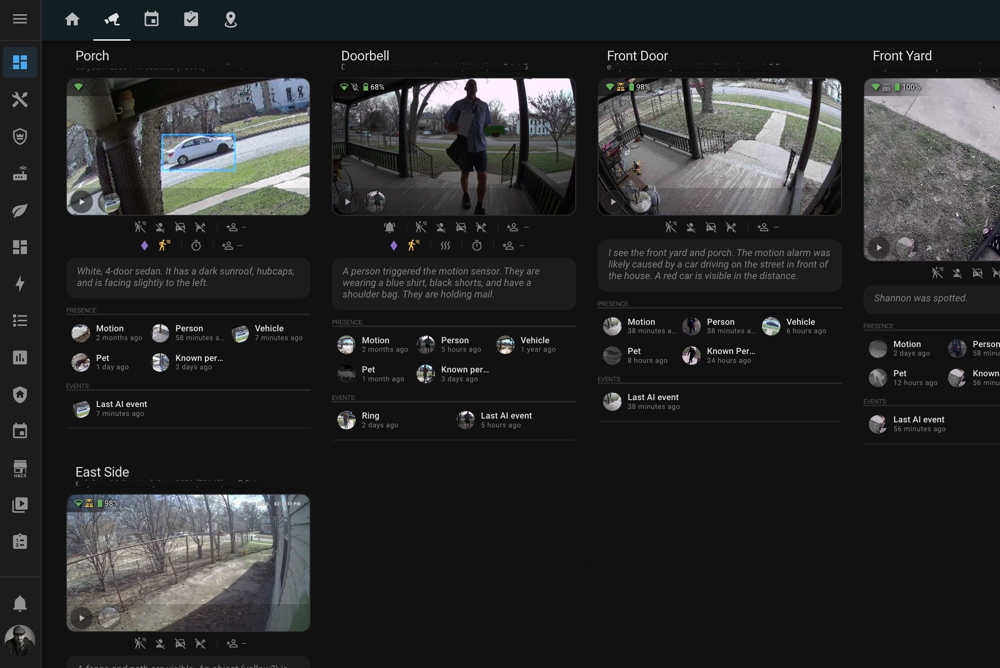
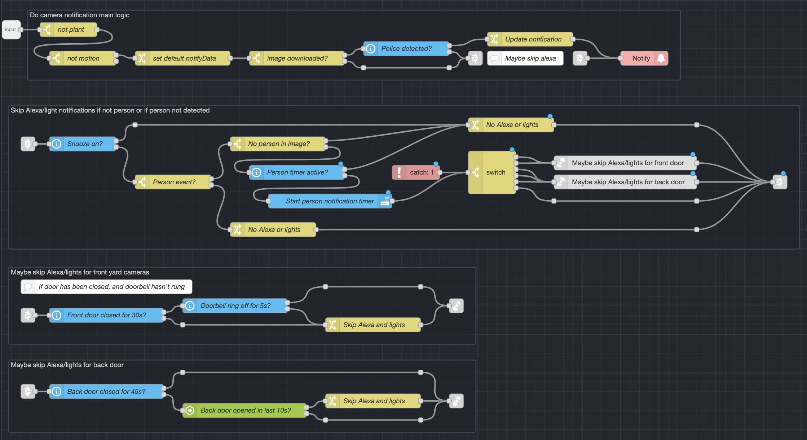

## Overview

This event-driven, asynchronous camera notification system processes motion events from security cameras, classifies and describes images, and sends notifications based on various detection types such as person, pet, vehicle, or motion. Using a series of timeouts, MQTT messaging, and integration with machine learning models like [YOLO](https://www.ultralytics.com/yolo) and [Google Gemini](https://gemini.google.com), the system aims to enhance detection accuracy and provide real-time alerts. It is built around an event-driven architecture that ensures responsiveness and scalability. [Home Assistant](https://www.home-assistant.io) supplies the data and triggers for automations, notification platform, and dashboard, while [Node-RED](https://www.nodered.org) orchestrates the logic and executes the workflows.

*Yes, of course I am aware of the security implications of using cloud-based AI to describe the images. This was more of an experiment to see what's possible than anything. I'm working on finding a locally-hosted alternative that will provide the description detail I want in under 5 seconds.*

## Key features

- **Event-Driven Architecture** – The system uses event-driven principles to handle motion detection and image processing efficiently
- **Image Verification** – YOLO and Google Gemini ensure accurate person detection and image description
- **Asynchronous Processing** – Timeouts and event-based triggers allow for asynchronous, non-blocking operations
- **Flexible Notification System** – Notifications are sent to all devices, with custom smart speaker announcements for person/known person events

## Tech stack

- [eufy-security-ws](https://github.com/bropat/eufy-security-ws) – integrates Eufy Security cameras into Home Assistant
- [Home Assistant](https://www.home-assistant.io) – provides interface to cameras and motion detections
- [Node-RED](https://www.nodered.org) – handles all logic for automations
- [YOLO](https://www.ultralytics.com/yolo) – provides AI-powered object detection
- [YOLO web service](https://github.com/JavierMtz5/YOLOv8-docker.git) – provides web API interface for YOLO inside Docker container
- [Google Gemini](https://gemini.google.com) – provides detailed description of image
- [EMQX](https://www.emqx.com) – MQTT broker used for messaging
- [Labelme](https://labelme.io/) – used for labelling images for iterative learning

## Workflow & system components

### 1. **Motion detection and initial event classification**

- The system listens for motion events from Eufy cameras via the Home Assistant (HA) binary sensors for motion, person, known person, pet, and vehicle
- When any of these motion sensors are triggered, a motion event is classified based on the sensor type (e.g., person, pet, vehicle)
- The system sets a 5-second timeout after motion is detected:
  - If the image does not change within this timeout, it fires an `image_change_timed_out` event
  - If the image changes within 2 seconds of the motion event, it fires an `image_changed` event and publishes this on the `cameras/[camera]/event` MQTT topic

### 2. **Image change and download**

- A Home Assistant state change node monitors the camera's last event image for changes
- When a change is detected, the system begins a timeout for downloading the image
- After the image is downloaded, it is copied into the correct location for the camera’s last motion image entity
- The timestamp for the last motion is updated, and a `download_complete` event is fired
- Other flows, like [trash can detection](../ai-trash-detection/), listen for the `download_complete` event to trigger subsequent actions

### 3. **Image classification / verification**

- When the `download_complete` event is triggered in MQTT and the detection type is "Person" or "Known Person", the image is sent to YOLO for classification, which is used to verify the cameras’ person detection
- If YOLO does not detect a person, the system changes the event type to a more generic "Motion" event
- A timeout is also set for this classification step

### 4a. **Image description**

- After the image is classified by YOLO, an `image_classified` event is triggered
- **If the event is a "known person" event and the person name is set** in the payload, AI is skipped and the description is set to "\[name\] was spotted"
- **A prompt is generated** for Google Gemini based on the following data:
  - Event type classification from camera (person, known person, pet, vehicle, or motion)
  - Verification information from YOLO
  - Whether or not the Automower is running (to help reduce false positives on pets)
- **Image and prompt are sent Google Gemini**
- Once finished, description is saved to a Home Assistant text entity, and a `describe_complete` event is emitted





### 4b. **Event-specific image handling**

- After the image is classified by YOLO, the image is copied into event-specific locations (if applicable)
- This provides Home Assistant the image entities for last motion, last person, last known person, last vehicle, and last pet, which can be used for notifications and dashboards



### 4c. **Collect images for iterative training**

- If the original event was a person but YOLO did not detect a person, collect images for later processing
- This allows for labelling false negatives (cases where a person was in the image) for future iterative training



### 5. **Describe complete & check for police**

- When the description is complete, a "image_processing_complete" event is fired on the MQTT topic `cameras/[camera_name]/event`
- The description is checked for key words and a "Police Detected" input boolean is turned on if police are detected
  - This is used in the camera notification flow to update the icon and set the notification level to "critical" which causes alerts to occur even when silenced



### 6. **Processing complete / timeout handling**

- If YOLO times out, the system proceeds directly to the description step without changing the event type
- If any other step times out, the system skips the remaining steps and goes directly to the notification logic below
- Once all steps have completed, a `image_processing_complete` event is sent over MQTT, which triggers the logic below
- If a person was detected (and verified by YOLO), an event is sent on  the `camera/[camera_name]/person` MQTT topic for use in other flows

### 7. **Notification logic**

- If the event type is "person", "known person", "pet", or "vehicle", a notification is sent to all devices
- For "person" and "known person" events, an announcement is made on smart speakers in rooms where people are present
- If the cameras recognize the person, the AI describe portion is skipped and "`[name]` spotted." is used as the description instead
- The flow also has logic to check if the closest door was recently opened to silence alarms when the front door was open (or opened shortly after) when a person was detected
- There are "person notification timers" for the front yard cameras as well as back yard cameras that are started when a person is detected
  - If a person is detected in the same area (front or back yard) while the timers are running, notifications are silenced to prevent notification fatigue

## Future improvements

- Locally-hosted alternative to Google Gemini
  - *Likely CLIP + GPT or similar running on an Apple M1, which is the only accelerated platform I have available at the moment*
- Support for image changes without related detection event
  - *Camera images occasionally update when a detection event did not occur. This would download those and update the latest camera's image without the describe or notification steps.*
- Support for multiple simultaneous detection types (e.g., image with a vehicle and person)
- Refinements to make the flow more asynchronous and modular—especially the portion that copies files into event-specific directories
- Reduce amount of data sent in payload / stored in flow context for improved memory efficiency less redundancy

## Summary

This system ensures that camera-triggered events are processed quickly and accurately, providing reliable notifications based on detected activity. A previous iteration of this logic used `wait-until` nodes instead of an event-driven process. The event-driven process ensures non-blocking execution, drastically improving the reliability of the notifications while simultaneously reducing resource usage by Node-RED.

---

## Change log

- **2025.03.25**:
  - Make capitalization consistent in headings
  - Add information about person notification timers that are used to prevent notification fatigue
  - Move police detection from the "image_downloaded" section of the flow to the "image_described" section to keep things consistent and break up "image_downloaded" logically
  - Move firing event on `camera/[camera_name]/person` to the end of the flow so YOLO verification will prevent superfluous events to be fired when YOLO says a person is not in the image
  - Only run YOLO verification on person events to reduce resource usage (since this is currently run on a non-accelerated CPU)
  - Update screenshots to reflect changes in flow mentioned above
- **2025.03.28**:
  - Fix missing classify_timed_out in final logic before sending notification
  - Simplified classify flow to use a single function node
- **2025.04.04**:
  - Add collection of images when YOLO did not detect a person but cameras did (for later processing)
