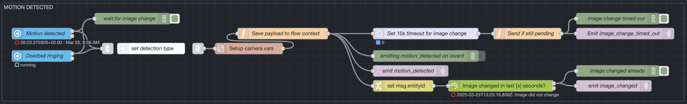
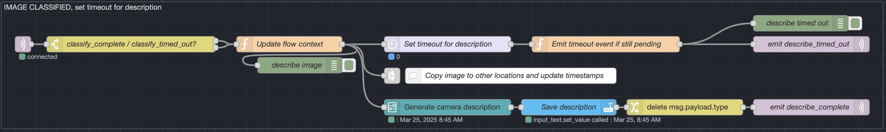
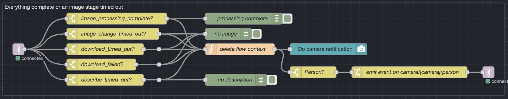

## Overview

This event-driven, asynchronous camera notification system processes motion events from security cameras, classifies and describes images, and sends notifications based on various detection types such as person, pet, vehicle, or motion. Using a series of timeouts, MQTT messaging, and integration with machine learning models like [YOLO](https://www.ultralytics.com/yolo) and [Google Gemini](https://gemini.google.com), the system aims to enhance detection accuracy and provide real-time alerts. It is built around an event-driven architecture that ensures responsiveness and scalability. [Home Assistant](https://www.home-assistant.io) supplies the data and triggers for automations, notification platform, and dashboard, while [Node-RED](https://www.nodered.org) orchestrates the logic and executes the workflows.

*Yes, of course I am aware of the security implications of using cloud-based AI to describe the images and I'm working on finding a locally-hosted alternative that will provide quality descriptions in less than 5 seconds.*

## Key Features

- **Event-Driven Architecture**: The system uses event-driven principles to handle motion detection and image processing efficiently.
- **Image Verification**: YOLO and Google Gemini ensure accurate person detection and image description.
- **Asynchronous Processing**: Timeouts and event-based triggers allow for asynchronous, non-blocking operations.
- **Flexible Notification System**: Notifications are sent to all devices, with custom smart speaker announcements for person/known person events.



## Workflow & System Components

### 1. **Motion detection and initial event classification**

- The system listens for motion events from Eufy cameras via the Home Assistant (HA) binary sensors for motion, person, known person, pet, and vehicle.
- When any of these motion sensors are triggered, a motion event is classified based on the sensor type (e.g., person, pet, vehicle).
- The system sets a 5-second timeout after motion is detected:
  - If the image does not change within this timeout, it fires an `image_change_timed_out` event.
  - If the image changes within 2 seconds of the motion event, it fires an `image_changed` event and publishes this on the `cameras/[camera]/event` MQTT topic.

### 2. **Image change monitoring and download**

- A Home Assistant state change node monitors the camera's last event image for changes.
- When a change is detected, the system begins a timeout for downloading the image.
- After the image is downloaded, it is copied into the correct location for the camera’s last motion image entity.
- The timestamp for the last motion is updated, and a `download_complete` event is fired.
- Other flows, like [trash can detection](../ai-trash-detection/), listen for the `download_complete` event to trigger subsequent actions.

### 3. **Image classification / verification with YOLO**

- When the `download_complete` event is triggered in MQTT, the image is sent to YOLO for classification, which is used to verify the camera’s person detection.
- If the event type is "person" and YOLO does not detect a person, the system changes the event type to a more generic "motion" event.
- A timeout is also set for this classification step.

### 5a. **Image description with Google Gemini**

- After the image is classified by YOLO, an `image_classified` event is triggered.
- The image is then sent to Google Gemini with a prompt (based on what was detected and verified by YOLO) for a description.
- Once the description is finished, it is saved to a Home Assistant text entity, and a `describe_complete` event is emitted.

### 5b. **Event-specific image handling**

- After the image is classified by YOLO, the image is copied into event-specific locations (if applicable), so Home Assistant has image entities for last motion, last person, last known person, last vehicle, and last pet, which can be used for notifications and dashboards.

### 7. **Timeout handling**

- If any of the steps (except the YOLO classification) times out, the system skips the remaining steps and moves on to the next one.
- If YOLO times out, the system proceeds directly to the description step without changing the event type.

### 8. **Notification**

- If the event type is "person", "known person", "pet", or "vehicle", a notification is sent to all devices.
- For "person" and "known person" events, an announcement is made on smart speakers in rooms where people are present.
- If the cameras recognize the person, the AI describe portion is skipped and "`[name]` spotted." is used as the description instead.

## Future Improvements

- Enhancing event filtering and classification capabilities
- More refinements to make the flow more asynchronous and modular
- Reducing amount of data sent in payload / stored in flow context for improved memory efficiency

This system ensures that camera-triggered events are processed quickly and accurately, providing reliable notifications to users based on detected activity.
