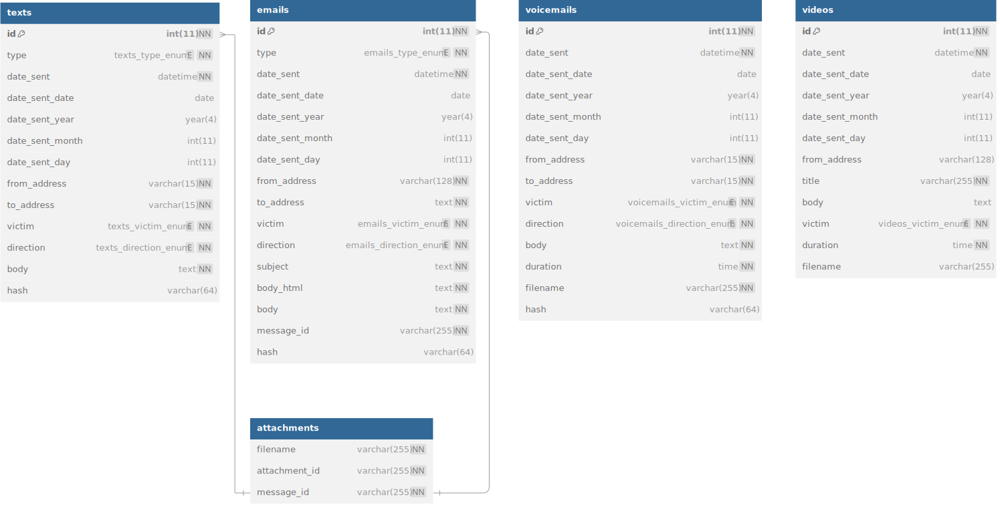

## Purpose

This project was developed to aggregate and centralize evidence of harassment and stalking incidents, providing fast, user-friendly, searchable access for law enforcement and the district attorney handling the case. It enabled investigators and attorneys to efficiently filter and review various forms of digital contact between the harasser and victims.

Project turnaround was of utmost importance as it dealt with an ongoing case. The original version of this project was created in about a day and a half with a rewrite happening a few months later. *Documentation on the Node.js/MongoDB rewrite of the project is coming soon.*

## Tech Stack

- [**Docker**](https://www.docker.com) – provides containerization for MySQL and both NGINX instances
- [**JavaScript**](https://www.javascript.com/) – powers the site's frontend logic
- [**MySQL**](https://www.mysql.com) – database used to store evidence
- [**NGINX**](https://nginx.org/) – web server; one instance serves the main site while a separate CDN instance is used for images, videos, and audio files
- [**PHP**](https://www.php.net) – powers the site's backend logic
- [**Traefik**](https://traefik.io/traefik/) - reverse proxy providing HTTPS

## Database schema

Since turnaround time was of utmost importance, I used the simplest method to store different communication types: each in their own table. This does not allow for easily adding new communication types, however that is a non-issue as no additional communication types have ever been needed.

Attachments are stored in a separate table to allow for a simple many-to-one relationship between texts / emails and attachments. The filename field stores the filename of the attachment in the filesystem which is accessible via the CDN.

### Texts

| Column Name         | Description                                            |
|---------------------|--------------------------------------------------------|
| **id**              | unique ID                                              |
| **date_sent**       | date communication was sent                            |
| **date_sent_year**  | generated column containing only year                  |
| **date_sent_month** | generated column containing only month number          |
| **date_sent_day**   | generated column containing only day number            |
| **from_address**    | phone number from which message was sent               |
| **to_address**      | phone number to which message was sent                 |
| **victim**          | victim involved in communication ("name 1", "name 2", or "both") |
| **direction**       | direction of message (IN = sent to victim; OUT = sent from victim) |
| **body**            | body of text                                           |
| **hash**            | MD5 hash of body/time/number used to detect potential duplicates |

### Emails

| Column Name         | Description                                            |
|---------------------|--------------------------------------------------------|
| **id**              | unique ID                                              |
| **date_sent**       | date communication was sent                            |
| **date_sent_year**  | generated column containing only year                  |
| **date_sent_month** | generated column containing only month number          |
| **date_sent_day**   | generated column containing only day number            |
| **from_address**    | email address from which message was sent              |
| **to_address**      | email address to which message was sent                |
| **victim**          | victim involved in communication ("name 1", "name 2", or "both") |
| **direction**       | direction of message (IN = sent to victim; OUT = sent from victim) |
| **subject**         | subject line from email                                |
| **body**            | text-only body of email                                |
| **body**            | HTML body of email (if applicable)                     |
| **message_id**      | used in path to email attachments to prevent filename collisions |
| **hash**            | MD5 hash of body/time/number used to detect potential duplicates during initial import |

### Voicemails

| Column Name         | Description                                            |
|---------------------|--------------------------------------------------------|
| **id**              | unique ID                                              |
| **date_sent**       | date communication was sent                            |
| **date_sent_year**  | generated column containing only year                  |
| **date_sent_month** | generated column containing only month number          |
| **date_sent_day**   | generated column containing only day number            |
| **from_address**    | phone number from which message was sent               |
| **to_address**      | phone number to which message was sent                 |
| **victim**          | victim involved in communication ("name 1", "name 2", or "both") |
| **direction**       | direction of message (IN = sent to victim; OUT = sent from victim) |
| **body**            | transcription of voicemail                             |
| **duration**        | duration of voicemail in seconds                       |
| **filename**        | filename of voicemail for embedding in web interface   |
| **hash**            | MD5 hash of body/time/number used to detect potential duplicates during initial import |

### Videos

| Column Name         | Description                                            |
|---------------------|--------------------------------------------------------|
| **id**              | unique ID                                              |
| **date_sent**       | date video was posted                                  |
| **date_sent_year**  | generated column containing only year                  |
| **date_sent_month** | generated column containing only month number          |
| **date_sent_day**   | generated column containing only day number            |
| **from_address**    | YouTube account on which video was posted              |
| **victim**          | victim involved in communication (unused; always "both") |
| **direction**       | direction of message (IN = sent to victim; OUT = sent from victim) |
| **title**           | title of video on YouTube                              |
| **body**            | automatic transcription of video from YouTube          |
| **duration**        | duration of video in seconds                           |
| **filename**        | filename of video for embedding in web interface       |

### Attachments

| Column Name         | Description                                            |
|---------------------|--------------------------------------------------------|
| **attachment_id**   | unique ID / primary key                                |
| **message_id**      | foreign key referencing either texts or emails tables  |
| **filename**        | filename of attachment                                 |

## Web UI

A performant, user-friendly web interface is what made the project useful to law enforcement by allowing centralized searchable access to a multitude of communications across a multitude of platforms.







## Impact

This system provided law enforcement with a structured, efficient way to review digital evidence, reducing time spent manually sorting through hundreds of scattered communications across many platforms. The alternative was hundreds and hundreds of screenshots and forwarded emails which quickly overloaded the investigator working the case.
